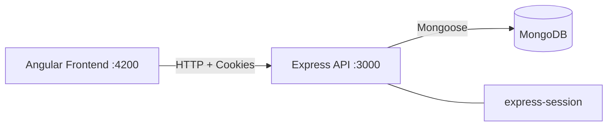
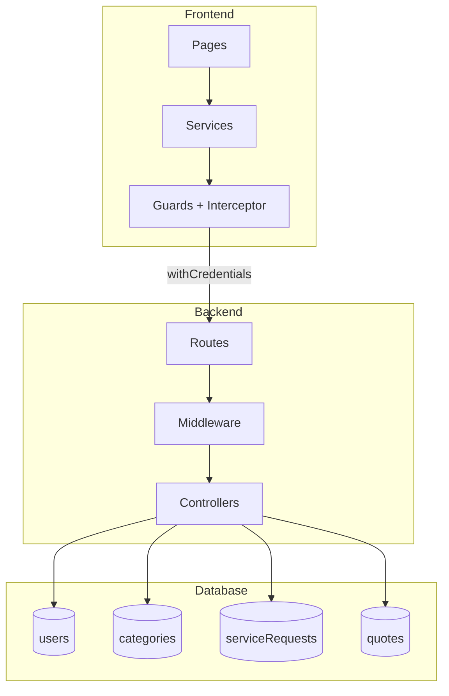
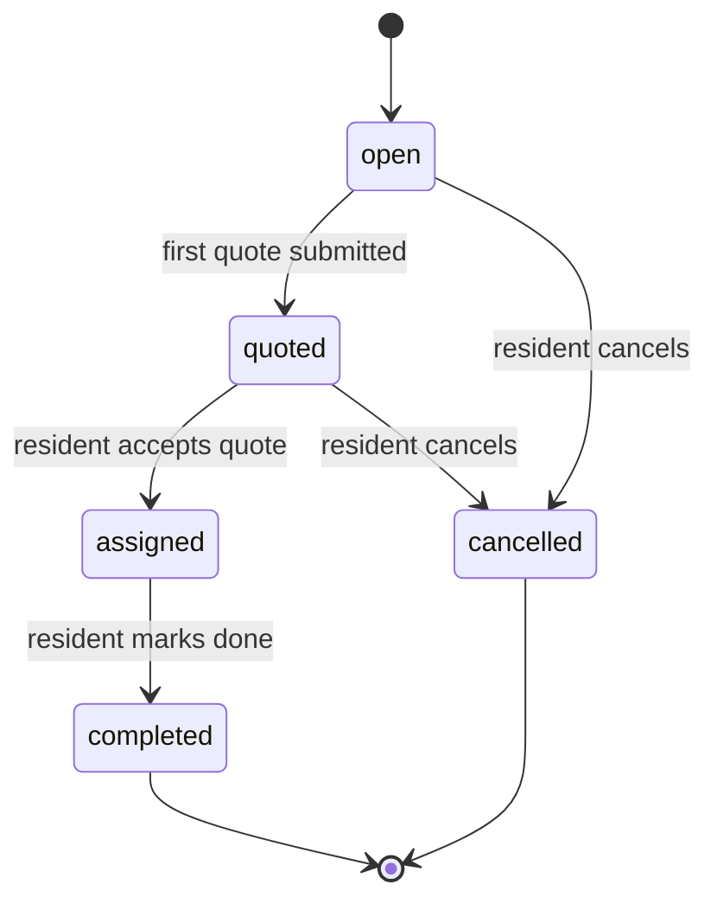
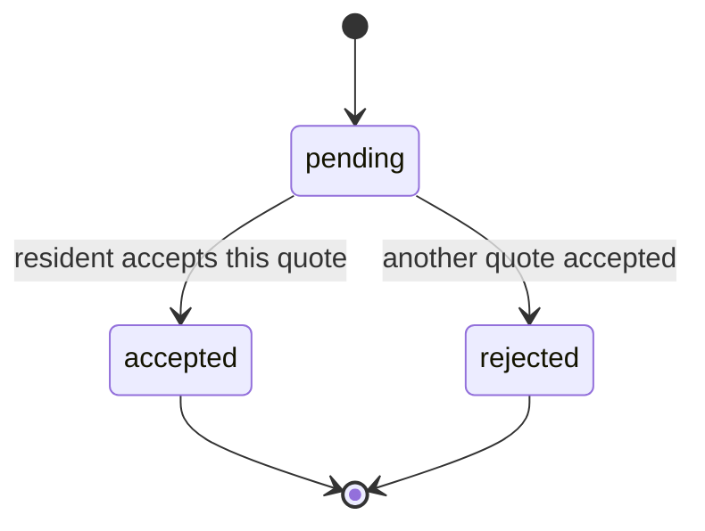

# Neighborhood Service Marketplace (NSM)

Full-stack web application where Residents post service requests and Providers submit quotes. Built with MongoDB, Express, Angular, and Node.js. Session-based authentication with role-based access control.

## Team

| Name                          | Student Number | Section |
| ----------------------------- | -------------- | ------- |
| Bessong Ekep Obasi Arrey-Etta | n01708502      | ON-A    |
| Raymond Choy                  | n01743348      | ON-A    |
| Harshit Sahni                 | n01734894      | ON-A    |
| Marcia Oliveira               | n01716166      | ON-A    |
| Phuoc Huy Truong              | n01741637      | ON-B    |

## System Architecture





**Backend** — Express server with session-based auth, role middleware, Mongoose ODM.
**Frontend** — Angular standalone components, reactive forms, Tailwind CSS, HTTP services with credentials interceptor.

### Folder Structure

```
backend/src/
  config/       db.js, session.js
  utils/        constants.js, env.js
  models/       users.js, Category.js, ServiceRequest.js, Quote.js
  controllers/  authController.js, categoryController.js, requestController.js, quoteController.js
  middleware/   requireAuth.js, requireRole.js, errorHandler.js
  routes/       authRoutes.js, categoryRoutes.js, requestRoutes.js, quoteRoutes.js
  app.js

frontend/src/app/
  core/         services/ (auth, category, request, quote), guards/ (auth, role), interceptors/
  models/       user, category, service-request, quote TypeScript interfaces
  pages/        login, register, requests-list, create-request, request-details, my-quotes
  shared/       navbar
```

## Setup Instructions

### Prerequisites

- Node.js 18+
- MongoDB (local, Docker, or Atlas connection string)

### Quick Start

**macOS / Linux:**

```bash
chmod +x start.sh && ./start.sh
```

**Windows:**

```
start.bat
```

### Manual Setup

**Backend:**

```bash
cd backend
cp .env.example .env    # edit MONGODB_URI if using Atlas
npm install
npm start               # runs on http://localhost:3000
```

**Frontend:**

```bash
cd frontend
npm install
ng serve                # runs on http://localhost:4200
```

### Environment Variables

| Variable         | Default                         | Description               |
| ---------------- | ------------------------------- | ------------------------- |
| `MONGODB_URI`    | `mongodb://localhost:27017/nsm` | MongoDB connection string |
| `SESSION_SECRET` | `devsecret`                     | Session encryption key    |
| `CLIENT_ORIGIN`  | `http://localhost:4200`         | CORS allowed origin       |
| `PORT`           | `3000`                          | Backend server port       |

## Database Schema

Four collections using a **referencing strategy** to avoid document bloat and keep updates simple.

### users

| Field        | Type   | Constraints                 |
| ------------ | ------ | --------------------------- |
| fullName     | String | required, 2–80 chars        |
| email        | String | required, unique, lowercase |
| passwordHash | String | required, bcrypt hashed     |
| role         | String | enum: resident, provider    |

### categories

| Field       | Type   | Constraints                  |
| ----------- | ------ | ---------------------------- |
| name        | String | required, unique, 2–50 chars |
| description | String | optional, max 200 chars      |

### serviceRequests

| Field           | Type         | Constraints                                        |
| --------------- | ------------ | -------------------------------------------------- |
| title           | String       | required, 5–80 chars                               |
| description     | String       | required, 10–1000 chars                            |
| categoryId      | ObjectId ref | required, references categories                    |
| createdBy       | ObjectId ref | required, references users                         |
| location        | String       | required, 2–80 chars                               |
| status          | String       | enum: open, quoted, assigned, completed, cancelled |
| acceptedQuoteId | ObjectId ref | set when quote accepted                            |

### quotes

| Field          | Type         | Constraints                          |
| -------------- | ------------ | ------------------------------------ |
| requestId      | ObjectId ref | required, references serviceRequests |
| providerId     | ObjectId ref | required, references users           |
| price          | Number       | required, min 1                      |
| message        | String       | required, 5–500 chars                |
| daysToComplete | Number       | required, 1–30                       |
| status         | String       | enum: pending, accepted, rejected    |

### Schema Design Justification

**Why referencing over embedding:**

- A request can receive many quotes. Embedding quotes inside requests leads to unbounded array growth and complicates pagination.
- Users and categories are shared across many documents. Referencing prevents duplication and ensures a single source of truth for updates.
- Quotes need independent status tracking and lifecycle management. Separate documents allow targeted queries and atomic status updates.

### Query Patterns

1. **List requests with filters** — filter by `status`, `categoryId`, keyword via `$text` search. Uses compound index `(status, categoryId)` and text index on `(title, description)`.
2. **Get quotes for a request** — lookup by `requestId`. Uses index on `quotes.requestId`.
3. **Provider "My Quotes"** — lookup by `providerId`. Uses index on `quotes.providerId`.

### Indexing Strategy

| Index                                    | Collection      | Purpose                                              |
| ---------------------------------------- | --------------- | ---------------------------------------------------- |
| `{ email: 1 }` unique                    | users           | Fast login lookup, prevent duplicates                |
| `{ name: 1 }` unique                     | categories      | Prevent duplicate category names                     |
| `{ title: "text", description: "text" }` | serviceRequests | Keyword search across request content                |
| `{ status: 1, categoryId: 1 }`           | serviceRequests | Compound filter for listing with status and category |
| `{ requestId: 1 }`                       | quotes          | Fast lookup of all quotes for a request              |
| `{ providerId: 1 }`                      | quotes          | Fast lookup for provider's own quotes                |
| `{ requestId: 1, providerId: 1 }` unique | quotes          | Prevent duplicate quotes per provider per request    |

These indexes support the three primary query patterns. The compound unique index on quotes also enforces a business rule at the database level. The text index enables the keyword search requirement without additional infrastructure.

### Scalability Considerations

- Referencing allows independent scaling of collections. Quotes can grow without affecting request document size.
- Indexes cover the primary access patterns. Additional indexes (e.g., on `createdBy` for "my requests" views) can be added as query patterns evolve.
- The accept-quote operation updates multiple documents sequentially. For production workloads with concurrent access, MongoDB transactions with a replica set would guarantee atomicity.
- Session storage uses in-memory store for development. Production deployments should use `connect-mongo` for persistent session storage.

## API Endpoints

### Auth

| Method | Endpoint             | Access        | Description                                     |
| ------ | -------------------- | ------------- | ----------------------------------------------- |
| POST   | `/api/auth/register` | Public        | Register user (fullName, email, password, role) |
| POST   | `/api/auth/login`    | Public        | Login, set session cookie                       |
| POST   | `/api/auth/logout`   | Public        | Destroy session                                 |
| GET    | `/api/auth/me`       | Authenticated | Get current user profile                        |

### Categories

| Method | Endpoint          | Access        | Description         |
| ------ | ----------------- | ------------- | ------------------- |
| GET    | `/api/categories` | Public        | List all categories |
| POST   | `/api/categories` | Authenticated | Create category     |

### Service Requests

| Method | Endpoint                   | Access           | Description                                    |
| ------ | -------------------------- | ---------------- | ---------------------------------------------- |
| POST   | `/api/requests`            | Resident         | Create service request                         |
| GET    | `/api/requests`            | Authenticated    | List requests (filters: status, categoryId, q) |
| GET    | `/api/requests/:id`        | Authenticated    | Get request details with populated refs        |
| PATCH  | `/api/requests/:id/status` | Resident (owner) | Update request status                          |

### Quotes

| Method | Endpoint                   | Access           | Description                                 |
| ------ | -------------------------- | ---------------- | ------------------------------------------- |
| POST   | `/api/requests/:id/quotes` | Provider         | Submit quote for a request                  |
| GET    | `/api/requests/:id/quotes` | Authenticated    | Get quotes for a request                    |
| PATCH  | `/api/quotes/:id/accept`   | Resident (owner) | Accept quote, reject others, assign request |
| GET    | `/api/quotes/mine`         | Provider         | Get provider's own quotes                   |

## Status Lifecycle

### Request Statuses



### Quote Statuses



## Testing

### Postman

Import `NSM.postman_collection.json` into Postman. Run requests in order (top to bottom). The collection auto-saves IDs between requests using collection variables.

Covered scenarios:

1. Register resident and provider
2. Duplicate email rejection (409)
3. Login resident
4. Create category
5. Create service request
6. Provider login and quote submission
7. Auto-transition to "quoted" status
8. Resident views and accepts quote
9. Verify assigned status and acceptedQuoteId
10. Mark request completed